# Central Mosque Rochdale - iOS Mobile App

A comprehensive iOS mobile app for Central Mosque Rochdale, built with SwiftUI. The app provides essential Islamic services including prayer times, Qibla compass, mosque events, donation campaigns, and push notifications.

## Current Visual Interface

### Light Mode Interface
| Home Screen | Events View | Donation View |
|:---------------------------:|:-----------------------------------:|:-----------------------------------------:|
| 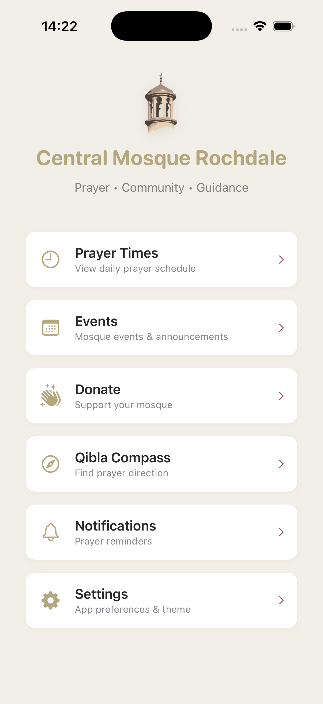 | 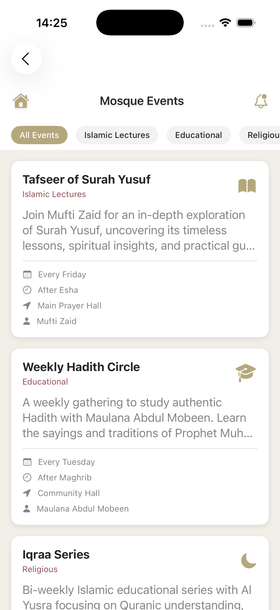 | 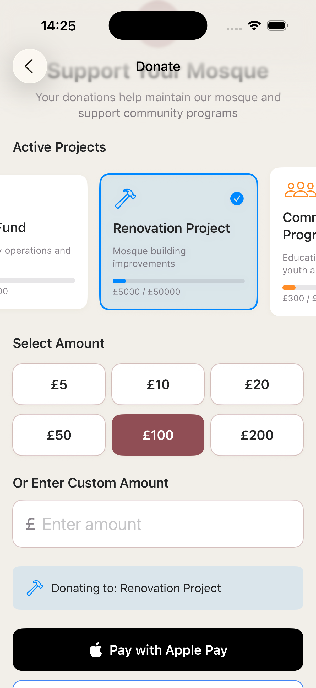 |

### Dark Mode Interface
| Home Screen | Events View | Donation View |
|:---------------------------:|:-----------------------------------:|:-----------------------------------------:|
| 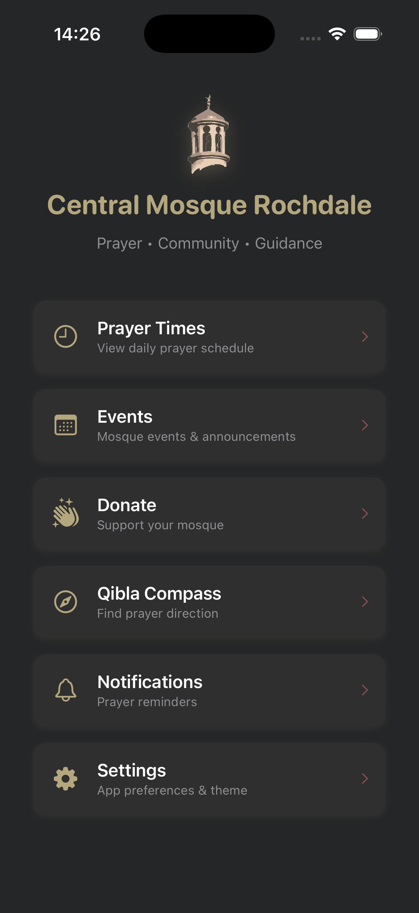 | 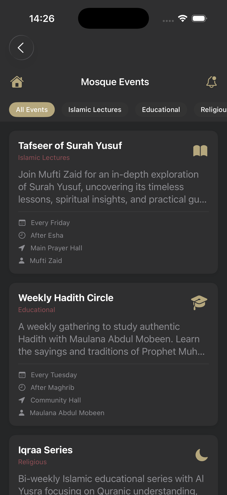 | 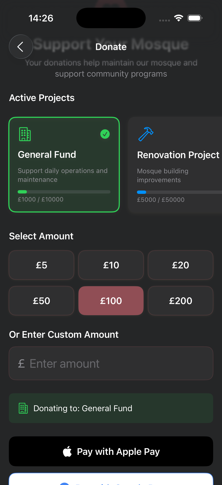 |

| Prayer Times Dark | Qibla Compass Dark | Notifications Dark |
|:---------------------------:|:-----------------------------------:|:-----------------------------------------:|
| 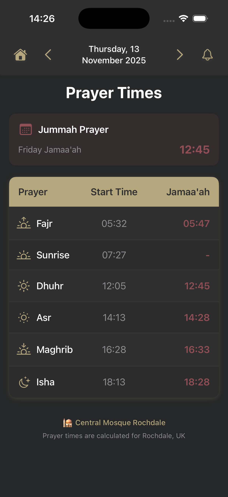 | 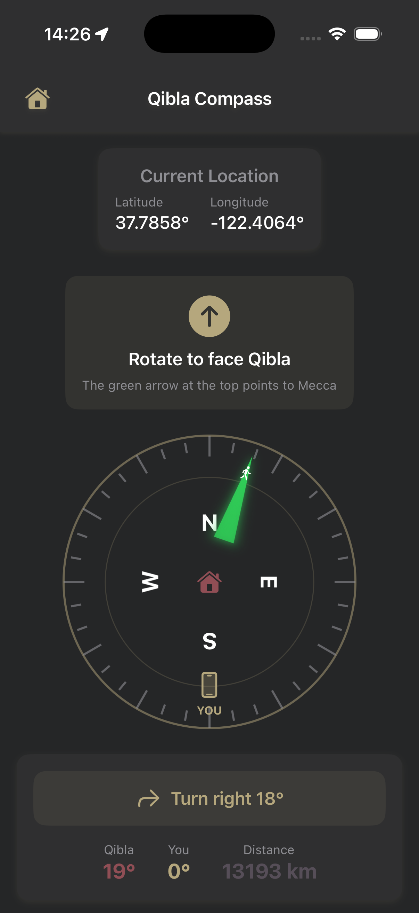 | 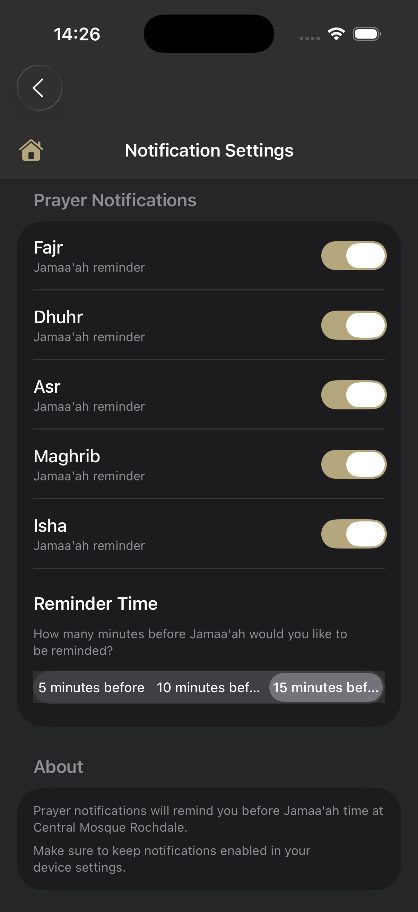 |

### Prayer Times Features
| Today's Prayer Times | Tomorrow's Prayer Times | Prayer Notifications |
|:---------------------------:|:-----------------------------------:|:-----------------------------------------:|
| 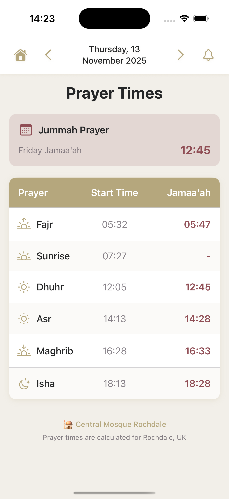 |  | 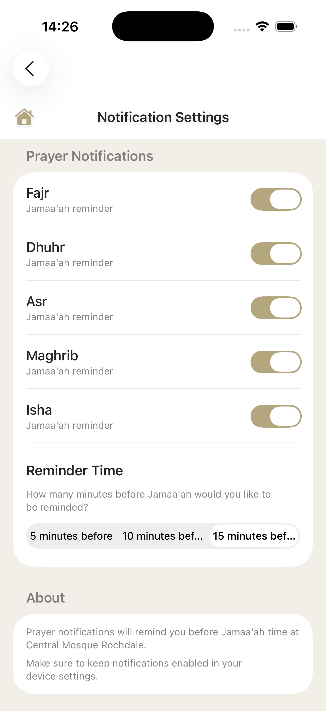 |

### Events Features
| Events List | Event Details | Event Notifications |
|:---------------------------:|:-----------------------------------:|:-----------------------------------------:|
|  | 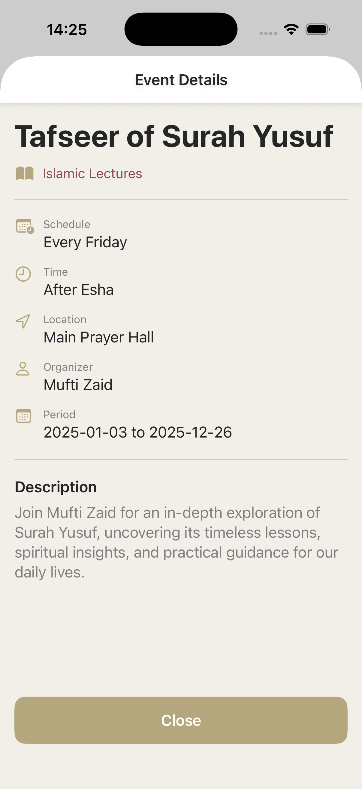 | 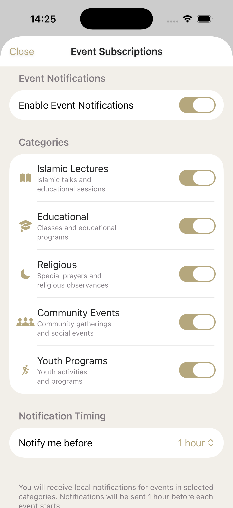 |

## 🕌 Core Features

### 📿 Prayer Times
- **Five Daily Prayers**: Displays Fajr, Dhuhr, Asr, Maghrib, and Isha prayer times
- **Jummah Times**: Special display for Friday congregation times
- **Table Format**: Shows prayer name, Adhan time, and Jamaa'ah (congregation) time
- **Date Navigation**: Browse prayer times for tomorrow (up to 5 days ahead) and yesterday
- **AWS S3 Integration**: Dynamically loads from S3 with local caching for offline access
- **Smart Caching**: Background updates ensure times are always current
- **Multi-Layer Fallback**: S3 → Cache → Bundled JSON for maximum reliability
- **Themed Design**: Fully integrated with Central Mosque Rochdale brand colors (gold, purple, rose)
- **Offline First**: Works without internet connection using cached data

### 🧭 Qibla Compass
- **Accurate Direction**: Real-time compass pointing toward Mecca (21.4225°N, 39.8262°E)
- **Location-based**: Uses device GPS for precise calculations
- **Live Orientation**: Device magnetometer and accelerometer integration
- **Visual Compass**: Animated compass with cardinal directions and degree markers
- **Distance Display**: Shows distance to Mecca in kilometers
- **Alignment Feedback**: Visual indicators when device is aligned with Qibla
- **Permission Handling**: Proper location permission management
- **Themed Interface**: Mosque brand colors with scrollable layout

### 📅 Mosque Events
- **Recurring Events**: 3 regular programs loaded from `MosqueEvents2025.json`:
  - Tafseer of Surah Yusuf (Weekly - Fridays after Esha)
  - Weekly Hadith Circle (Weekly - Tuesdays after Maghrib)
  - Iqraa Series (Bi-weekly - Saturdays after Esha)
- **Category Filtering**: Filter events by type (Lecture, Education, Religious, Community, Youth)
- **Event Details**: Full description, schedule, location, and organizer information
- **Local Data**: No backend required, fully offline functionality
- **Subscription Settings**: Customize notification preferences for event categories

### 💝 Donation System
- **Active Projects**: 5 donation campaigns loaded from `DonationProjects.json`:
  - General Fund (£6,500 / £10,000)
  - Renovation Project (£32,000 / £50,000)
  - Community Programs (£8,500 / £15,000)
  - Ramadan Food Bank (£5,200 / £8,000)
  - Islamic School (£7,800 / £12,000)
- **Progress Tracking**: Visual progress bars showing campaign goals and current amounts
- **Quick Amounts**: Pre-set donation amounts (£5, £10, £20, £50, £100, £200)
- **Custom Amount**: Enter any donation amount
- **Payment Integration**: Apple Pay, Google Pay (placeholder), and Card payment (placeholder)
- **Project Selection**: Choose specific project or general donation
- **Dynamic Updates**: Edit JSON file to update campaign progress

### 🔔 Push Notifications
- **Prayer Reminders**: Customizable alerts for each prayer before Jamaa'ah time
- **Timing Options**: 5, 10, or 15 minutes before Jamaa'ah
- **Individual Controls**: Toggle notifications for specific prayers (Fajr, Dhuhr, Asr, Maghrib, Isha)
- **Local Notifications**: UserNotifications framework (no server required yet)
- **Settings Persistence**: User preferences saved with UserDefaults
- **Permission Management**: Proper authorization flow and settings guidance

### 🎨 Theme System
- **Brand Colors**: 
  - Primary Gold: #B5A77D
  - Secondary Purple: #564E58
  - Accent Rose: #904E55
- **Dark Mode Support**: Automatic theme switching based on system preference
- **Consistent Design**: All views use centralized ThemeManager
- **Card-based UI**: Modern card layouts with shadows and rounded corners
- **Custom Headers**: Each view has branded navigation with home buttons


## 📁 Project Structure

```
centralmosquerochdale/
├── iOS/
│   ├── CentralMosqueRochdale/
│   │   ├── CentralMosqueRochdaleApp.swift    # App entry point
│   │   ├── Info.plist                         # iOS permissions and config
│   │   ├── Views/                             # All SwiftUI views
│   │   │   ├── ContentView.swift              # Main navigation hub
│   │   │   ├── PrayerTimesView.swift          # Prayer times with date navigation
│   │   │   ├── QiblaCompassView.swift         # Qibla compass with CoreLocation
│   │   │   ├── MosqueEventsView.swift         # Events display and filtering
│   │   │   ├── EventSubscriptionView.swift    # Event notification preferences
│   │   │   ├── DonationView.swift             # Donation campaigns and payments
│   │   │   ├── NotificationSettingsView.swift # Prayer notification settings
│   │   │   └── SettingsView.swift             # App settings and theme toggle
│   │   ├── ViewModels/                        # Business logic
│   │   │   └── ThemeManager.swift             # Centralized theme management
│   │   ├── Resources/                         # JSON data files
│   │   │   ├── PrayerTimes2025.json           # Full year prayer schedule
│   │   │   ├── MosqueEvents2025.json          # Recurring events data
│   │   │   └── DonationProjects.json          # Active donation campaigns
│   │   ├── Assets.xcassets/                   # Images and colors
│   │   │   ├── AppIcon.appiconset/            # App icons
│   │   │   ├── MosqueLogo.imageset/           # Mosque logo
│   │   │   └── AccentColor.colorset/          # Brand accent color
│   │   └── Preview Content/                   # Xcode preview assets
│   └── CentralMosqueRochdale.xcodeproj/       # Xcode project file
├── SwiftUI/                                    # Legacy/reference implementations
│   ├── DonationView.swift
│   ├── EventSubscriptionView.swift
│   ├── MosqueEventsView.swift
│   ├── NotificationSettingsView.swift
│   ├── PrayerTimesView.swift
│   └── QiblaCompassView.swift
├── JetpackCompose/                             # Android implementations (future)
│   ├── PrayerTimesCompose.kt
│   ├── QiblaCompassCompose.kt
│   ├── NotificationSettingsCompose.kt
│   ├── MosqueEventsCompose.kt
│   └── EventSubscriptionCompose.kt
├── docs/
│   ├── screenshots/                            # App screenshots
│   ├── QiblaCompass_README.md                 # Qibla feature documentation
│   ├── NotificationSystem_README.md           # Notifications documentation
│   └── MosqueEvents_README.md                 # Events system documentation
├── scripts/                                    # Build and deployment scripts
└── README.md                                   # This file
```

## 🛠 Technical Implementation

### Architecture
- **MVVM Pattern**: ViewModels for business logic, Views for UI
- **ObservableObject**: Reactive state management with `@Published` properties
- **Environment Objects**: Shared ThemeManager across all views
- **JSON Data Sources**: Local files for prayer times, events, and donations

### Key Components

#### ThemeManager (ViewModels/)
```swift
class ThemeManager: ObservableObject {
    @Published var isDarkMode: Bool
    var primaryColor: Color    // Gold #B5A77D
    var secondaryColor: Color  // Purple #564E58
    var accentColor: Color     // Rose #904E55
    // ... dynamic colors based on dark/light mode
}
```

#### Prayer Times Service
- Reads from `PrayerTimes2025.json`
- Date-based navigation (yesterday, today, +5 days)
- Supports Adhan, Jamaa'ah, and Jummah times
- Offline-first architecture

#### Event Service
- Loads from `MosqueEvents2025.json`
- Filters by category and active status
- Displays recurrence patterns (weekly, bi-weekly)
- Local notification preferences with `@AppStorage`

#### Donation ViewModel
- Loads projects from `DonationProjects.json`
- Filters active projects, sorts by priority
- Calculates progress percentages
- Integrates with Apple Pay (PaymentCoordinator)
- **Location Services**: CoreLocation framework

### iOS Technologies
- **Framework**: SwiftUI (iOS 15.0+)
- **Location Services**: CoreLocation framework for GPS and compass
- **Notifications**: UserNotifications framework (local notifications)
- **Data Persistence**: UserDefaults and @AppStorage for preferences
- **Payments**: PassKit for Apple Pay integration
- **Navigation**: SwiftUI NavigationView and sheet presentations
- **State Management**: Combine framework with ObservableObject
- **JSON Parsing**: Codable protocol for type-safe data loading

## 🔧 Dependencies

### iOS (SwiftUI)
- iOS 15.0+ (for modern SwiftUI features)
- CoreLocation (location services and compass)
- UserNotifications (local notifications - push notifications require APNs)
- PassKit (Apple Pay donation processing)
- Combine (reactive programming)
- Foundation (JSON parsing, UserDefaults)

### Required Permissions (Info.plist)
```xml
<key>NSLocationWhenInUseUsageDescription</key>
<string>We need your location to calculate the direction to Mecca for the Qibla compass.</string>

<key>NSLocationAlwaysAndWhenInUseUsageDescription</key>
<string>We need your location to provide accurate prayer times and Qibla direction.</string>
```

## 🚀 Getting Started

### Prerequisites
- **macOS**: macOS Ventura or later
- **Xcode**: Xcode 14.0+ 
- **iOS Deployment Target**: iOS 15.0+
- **Apple Developer Account**: Required for device testing and App Store deployment

### Installation
1. Clone the repository:
   ```bash
   git clone https://github.com/BMustafa97/centralmosquerochdale.git
   cd centralmosquerochdale
   ```

2. Open the Xcode project:
   ```bash
   open iOS/CentralMosqueRochdale.xcodeproj
   ```

3. Select your development team in Xcode:
   - Open project settings
   - Select "CentralMosqueRochdale" target
   - Go to "Signing & Capabilities"
   - Select your team from the dropdown

4. Build and run:
   - Select iPhone simulator or connected device
   - Press `Cmd + R` or click the Run button

### JSON Data Files
The app uses three JSON files in `iOS/CentralMosqueRochdale/Resources/`:

1. **PrayerTimes2025.json**: Full year of prayer times
   ```json
   {
     "prayerTimes": [
       {
         "date": "2025-01-01",
         "prayers": {...},
         "jummah": {...}
       }
     ]
   }
   ```

2. **MosqueEvents2025.json**: Recurring events
   ```json
   {
     "events": [
       {
         "id": "tafseer-yusuf",
         "title": "Tafseer of Surah Yusuf",
         "category": "lecture",
         "recurrence": "weekly",
         ...
       }
     ]
   }
   ```

3. **DonationProjects.json**: Active campaigns
   ```json
   {
     "projects": [
       {
         "id": "general-fund",
         "title": "General Fund",
         "goal": 10000,
         "raised": 6500,
         ...
       }
     ]
   }
   ```

## � Current Status & TODOs

### ✅ Completed Features
- [x] Prayer Times view with date navigation
- [x] Qibla Compass with location services
- [x] Mosque Events display and filtering
- [x] Donation campaigns with Apple Pay integration
- [x] Local notification settings (UI complete)
- [x] Theme system with dark mode support
- [x] JSON-based data architecture
- [x] Offline-first functionality
- [x] Full brand theming (gold/purple/rose colors)

### 🔄 In Progress
- [ ] MVVM architecture cleanup (consolidate duplicate Views/)
- [ ] Xcode project file reference cleanup

### 🎯 High Priority TODOs

#### 1. **S3 Backend for JSON Files** 🔴 CRITICAL
**Why**: Enable remote updates without app store submissions
- **Prayer Times**: Update daily/weekly prayer schedules
- **Events**: Add/modify/cancel events dynamically
- **Donation Campaigns**: Update raised amounts and add new projects

**Implementation Plan**:
```swift
// Replace local JSON loading with S3 URLs
let s3BaseURL = "https://centralmosque-rochdale.s3.eu-west-2.amazonaws.com"
let prayerTimesURL = "\(s3BaseURL)/prayer-times-2025.json"
let eventsURL = "\(s3BaseURL)/mosque-events.json"
let donationsURL = "\(s3BaseURL)/donation-projects.json"

// Add caching layer with local fallback
// Implement periodic refresh (daily for prayer times, hourly for events/donations)
// Add version checking to minimize downloads
```

**S3 Bucket Setup**:
- Bucket: `centralmosque-rochdale`
- Region: `eu-west-2` (London)
- Public read access for JSON files
- CORS configuration for iOS app access
- Versioning enabled for rollback capability

#### 2. **Apple Push Notifications (APNs)** 🔴 CRITICAL
**Why**: Real-time prayer reminders and event notifications

**Requirements**:
- ⚠️ **Apple Developer Program membership** ($99/year) - REQUIRED
- APNs certificates (Development & Production)
- Backend notification server (Firebase Cloud Messaging or custom)

**Implementation Steps**:
1. **Enable Push Notifications in Xcode**:
   - Signing & Capabilities → Add "Push Notifications"
   - Add "Background Modes" → Remote notifications

2. **Generate APNs Certificates**:
   - Apple Developer Portal → Certificates, Identifiers & Profiles
   - Create APNs Auth Key or SSL Certificate
   - Download and configure in backend

3. **Update NotificationSettingsView**:
   ```swift
   // Request remote notification permission
   UNUserNotificationCenter.current().requestAuthorization(
       options: [.alert, .sound, .badge]
   ) { granted, error in
       if granted {
           DispatchQueue.main.async {
               UIApplication.shared.registerForRemoteNotifications()
           }
       }
   }
   ```

4. **Backend Integration**:
   - Store device tokens in database
   - Schedule notifications based on prayer times
   - Send event reminders based on user subscriptions

#### 3. **Firebase Setup (Optional but Recommended)** 🟡 MEDIUM
**Why**: Simplified push notifications, analytics, and crash reporting

**Setup Process**:
1. Create Firebase project at https://console.firebase.google.com
2. Add iOS app with bundle ID: `com.centralmosque.rochdale`
3. Download `GoogleService-Info.plist` → Add to Xcode project
4. Install Firebase SDK via Swift Package Manager:
   ```swift
   // File → Add Packages → https://github.com/firebase/firebase-ios-sdk
   dependencies: [
       .package(url: "https://github.com/firebase/firebase-ios-sdk", from: "10.0.0")
   ]
   ```

5. Initialize in `CentralMosqueRochdaleApp.swift`:
   ```swift
   import Firebase
   
   @main
   struct CentralMosqueRochdaleApp: App {
       init() {
           FirebaseApp.configure()
       }
       // ...
   }
   ```

**Firebase Features to Use**:
- **Cloud Messaging**: Push notifications
- **Analytics**: User engagement tracking
- **Crashlytics**: Crash reporting and diagnostics
- **Remote Config**: Feature flags and A/B testing
- **Performance Monitoring**: App performance insights

### � Future Enhancements

#### Medium Priority
- [ ] Real-time prayer time calculations (location-based)
- [ ] Hijri calendar integration
- [ ] Multiple calculation methods (ISNA, MWL, Egypt, etc.)
- [ ] Arabic/Urdu localization
- [ ] Widget extension for prayer times
- [ ] Watch app for quick Qibla direction
- [ ] SharePlay for event attendance

#### Low Priority
- [ ] Quran integration with audio
- [ ] Dhikr counter (digital tasbih)
- [ ] Community forum/chat
- [ ] Live streaming for Jummah
- [ ] Nearby mosque finder
- [ ] Islamic calendar with important dates
- [ ] Donation receipts via email

## 🔐 Security & Privacy

### Data Collection
- **Location**: Only when using Qibla Compass (not stored)
- **Notifications**: Preferences stored locally on device
- **Donations**: Payment handled by Apple Pay (PCI compliant)
- **No Analytics**: Currently no tracking or analytics implemented

### Planned Data Handling (with Backend)
- Device tokens for push notifications (encrypted, never shared)
- Anonymous usage statistics (opt-in only)
- No personal information collected without explicit consent

## 📱 App Store Deployment

### Checklist
- [ ] Apple Developer Account ($99/year)
- [ ] App Store Connect listing
- [ ] App Store screenshots (6.5", 5.5", iPad Pro)
- [ ] App Store description and keywords
- [ ] Privacy policy URL
- [ ] Terms of service
- [ ] App icon (1024x1024px)
- [ ] TestFlight beta testing
- [ ] App Store review submission

### Bundle Configuration
- **Bundle ID**: `com.centralmosque.rochdale`
- **Version**: 1.0.0
- **Build Number**: Auto-increment per release
- **Category**: Lifestyle / Reference
- **Age Rating**: 4+

## 🤝 Contributing

Contributions welcome! Please:
1. Fork the repository
2. Create a feature branch (`git checkout -b feature/amazing-feature`)
3. Commit changes (`git commit -m 'Add amazing feature'`)
4. Push to branch (`git push origin feature/amazing-feature`)
5. Open a Pull Request

## 📄 License

This project is proprietary software for Central Mosque Rochdale.

## 👥 Contact

**Central Mosque Rochdale**
- Website: [centralmosquerochdale.org](https://centralmosquerochdale.org)
- Email: info@centralmosquerochdale.org

**Developer**
- GitHub: [@BMustafa97](https://github.com/BMustafa97)

---

**Built with ❤️ for the Central Mosque Rochdale community**