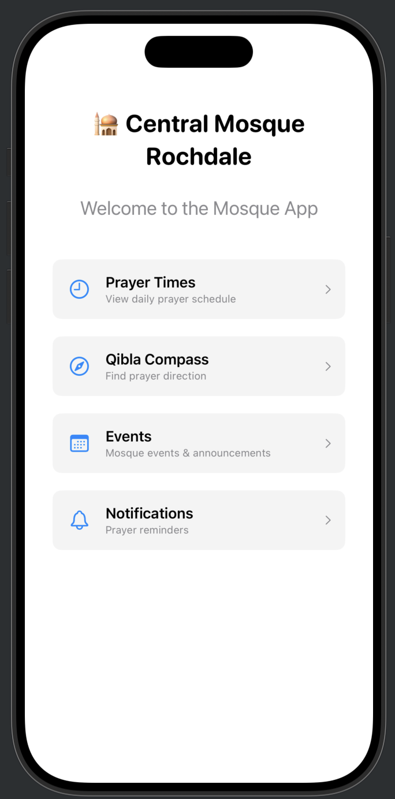

# Central Mosque Rochdale - Mobile App Suite

A comprehensive mobile app suite for Central Mosque Rochdale, built with SwiftUI (iOS) and Jetpack Compose (Android) frameworks. The app provides essential Islamic services including prayer times, Qibla compass, push notifications, and mosque events management.

## Current Visual Interface

<div style="display: flex; gap: 20px; align-items: center; flex-wrap: wrap;">
    <div>
        
        <p><em>iOS SwiftUI Home Interface</em></p>
    </div>
    <div>
        
        <p><em>iOS SwiftUI Prayer Times Interface</em></p>
    </div>
    <div>
        
        <p><em>iOS Push Notification Settings Interface</em></p>
    </div>
</div>


## 🕌 Core Features

### 📿 Prayer Times
- **Five Daily Prayers**: Displays Fajr, Dhuhr, Asr, Maghrib, and Isha prayer times
- **Table Format**: Shows prayer name, start time, and Jamaa'ah (congregation) time
- **Mock API Integration**: Simulates fetching data from a remote API
- **Loading States**: Proper loading indicators and error handling
- **Pull-to-Refresh**: Refresh functionality for updated prayer times
- **Responsive Design**: Optimized for different screen sizes

### 🧭 Qibla Compass
- **Accurate Direction**: Real-time compass pointing toward Mecca
- **Location-based**: Uses device GPS for precise calculations
- **Live Orientation**: Device magnetometer and accelerometer integration
- **Visual Compass**: Beautiful animated compass with cardinal directions
- **Permission Handling**: Proper location permission management

### 🔔 Push Notifications
- **Prayer Reminders**: Customizable alerts for each prayer
- **Timing Options**: 5, 10, or 15 minutes before Jamaa'ah time
- **Individual Controls**: Toggle notifications for specific prayers
- **APNs & FCM**: Native iOS and Android push notification systems
- **Settings Persistence**: User preferences saved locally

### 📅 Mosque Events System
- **Event Categories**: 8 distinct categories (Lectures, Fundraising, Community, etc.)
- **Admin Management**: Secure event creation and management
- **User Subscriptions**: Choose which event types to follow
- **Registration System**: Event registration with attendance limits
- **Push Notifications**: Automatic event reminders based on preferences

## SwiftUI Implementation

### Key Components

- **`Prayer`**: Data model representing a single prayer with name, start time, and Jamaa'ah time
- **`PrayerTimesService`**: ObservableObject that handles mock API calls and state management
- **`PrayerTimesView`**: Main view with navigation and state handling
- **`PrayerTimesTable`**: Table component displaying the prayer times
- **`PrayerRowView`**: Individual row component for each prayer

### Features
- SwiftUI's `@StateObject` and `@Published` for reactive state management
- Pull-to-refresh with `.refreshable` modifier
- Loading and error states with proper UI feedback
- Modern iOS design with system colors and shadows

### Usage
```swift
struct ContentView: View {
    var body: some View {
        PrayerTimesView()
    }
}
```

## Jetpack Compose Implementation

### Key Components

- **`Prayer`**: Data class representing prayer information
- **`PrayerTimesState`**: State class for managing UI state
- **`PrayerTimesService`**: Service class for mock API calls
- **`PrayerTimesViewModel`**: ViewModel with StateFlow for state management
- **`PrayerTimesScreen`**: Main screen composable with Scaffold
- **`PrayerTimesTable`**: Table composable with Card design
- **`PrayerRow`**: Individual row composable

### Features
- MVVM architecture with ViewModel and StateFlow
- Material Design 3 components and theming
- Proper state management with `collectAsState()`
- Loading indicators and error handling
- Responsive layout with proper weight distribution

### Usage
```kotlin
class MainActivity : ComponentActivity() {
    override fun onCreate(savedInstanceState: Bundle?) {
        super.onCreate(savedInstanceState)
        setContent {
            MaterialTheme {
                PrayerTimesScreen()
            }
        }
    }
}
```

## Mock API Data

Both implementations use the same mock prayer times:

| Prayer | Start Time | Jamaa'ah Time |
|--------|------------|---------------|
| Fajr   | 05:30      | 05:45         |
| Dhuhr  | 12:45      | 13:00         |
| Asr    | 16:15      | 16:30         |
| Maghrib| 18:45      | 18:50         |
| Isha   | 20:30      | 20:45         |

## 📁 Project Structure

```
centralmosquerochdale/
├── SwiftUI/                          # iOS Implementation
│   ├── PrayerTimesView.swift         # Prayer times display
│   ├── QiblaCompassView.swift        # Qibla compass with CoreLocation
│   ├── NotificationSettingsView.swift # Push notification management
│   ├── MosqueEventsView.swift        # Events system
│   └── EventSubscriptionView.swift   # Event subscription management
├── JetpackCompose/                   # Android Implementation
│   ├── PrayerTimesCompose.kt         # Prayer times display
│   ├── QiblaCompassCompose.kt        # Qibla compass with LocationManager
│   ├── NotificationSettingsCompose.kt # Push notification management
│   ├── MosqueEventsCompose.kt        # Events system
│   └── EventSubscriptionCompose.kt   # Event subscription management
├── iOS/                              # iOS Configuration
│   └── Info.plist                    # iOS permissions and settings
├── Android/                          # Android Configuration
│   ├── AndroidManifest.xml           # Android permissions and services
│   └── build.gradle                  # Dependencies and build config
└── Documentation/                    # Comprehensive documentation
    ├── QiblaCompass_README.md
    ├── NotificationSystem_README.md
    └── MosqueEvents_README.md
```

## 🛠 Technical Implementation

### iOS (SwiftUI)
- **Architecture**: MVVM with ObservableObject and @Published
- **Networking**: URLSession with async/await
- **Location Services**: CoreLocation framework
- **Notifications**: UserNotifications framework with APNs
- **Data Persistence**: UserDefaults for user preferences
- **Navigation**: SwiftUI NavigationView and sheet presentations

### Android (Jetpack Compose)
- **Architecture**: MVVM with StateFlow and ViewModel
- **Networking**: OkHttp with Gson for JSON parsing
- **Location Services**: Android LocationManager and FusedLocationProvider
- **Notifications**: Firebase Cloud Messaging (FCM)
- **Background Tasks**: WorkManager for reliable notifications
- **Data Persistence**: SharedPreferences and DataStore

## 🔧 Dependencies

### iOS (SwiftUI)
- iOS 15.0+ (for modern SwiftUI features)
- CoreLocation (location services)
- UserNotifications (local and remote notifications)
- Combine (reactive programming)

### Android (Jetpack Compose)
```gradle
// Core Dependencies
implementation 'androidx.compose.material3:material3:1.1.2'
implementation 'androidx.lifecycle:lifecycle-viewmodel-compose:2.7.0'
implementation 'androidx.work:work-runtime-ktx:2.8.1'

// Firebase
implementation 'com.google.firebase:firebase-messaging-ktx:23.3.1'
implementation 'com.google.firebase:firebase-analytics-ktx:21.5.0'

// Location Services
implementation 'com.google.android.gms:play-services-location:21.0.1'

// Networking
implementation 'com.squareup.retrofit2:retrofit:2.9.0'
implementation 'com.squareup.retrofit2:converter-gson:2.9.0'
```

## 🚀 Getting Started

### iOS Setup
1. **Xcode Requirements**: Xcode 14.0+ with iOS 15.0+ deployment target
2. **Permissions**: Configure Info.plist with location and notification permissions
3. **APNs Setup**: Configure Apple Push Notification service certificates
4. **Build**: Open project in Xcode and build for simulator or device

### Android Setup
1. **Android Studio**: Android Studio Electric Eel+ with API 24+ target
2. **Firebase**: Add google-services.json to app directory
3. **Permissions**: Configure runtime permissions for location and notifications
4. **Build**: Sync project and build APK or AAB

## 🔐 Configuration

### API Endpoints
Update base URLs in both implementations:
- **iOS**: `EventAPIService.baseURL`
- **Android**: `EventAPIService.baseURL`

### Firebase Setup (Android)
1. Create Firebase project at https://console.firebase.google.com
2. Add Android app with package name `com.centralmosque.rochdale`
3. Download `google-services.json` and place in `app/` directory
4. Configure FCM for push notifications

### APNs Setup (iOS)
1. Create App ID in Apple Developer Portal
2. Generate APNs certificates for development/production
3. Configure app with proper bundle identifier
4. Test push notifications via APNs

## 🎨 Customization

### Branding
- **Colors**: Update brand colors in both Material Theme (Android) and Color assets (iOS)
- **Icons**: Replace app icons and category icons with mosque-specific imagery
- **Typography**: Customize fonts and text styles for better readability
- **Layout**: Adjust spacing, padding, and component sizing

### Localization
- **Arabic Support**: Add RTL support for Arabic language
- **Multiple Languages**: Implement localization for Urdu, Bengali, etc.
- **Prayer Names**: Localize prayer names and Islamic terms
- **Date Formats**: Support Islamic calendar alongside Gregorian

## 🚀 Future Enhancements

### Prayer Times
- **Real API Integration**: Connect to Islamic prayer time services
- **Location-based Calculation**: Automatic prayer times based on user location
- **Multiple Calculation Methods**: Support different madhabs and calculation methods
- **Seasonal Adjustments**: Automatic prayer time updates throughout the year

### Advanced Features
- **Islamic Calendar**: Hijri calendar integration with important dates
- **Dhikr Counter**: Digital tasbih counter with customizable supplications
- **Quran Integration**: Verses of the day and audio recitation
- **Mosque Finder**: Nearby mosque locator with directions
- **Donation System**: Integrated donation platform for mosque support

### Community Features
- **User Profiles**: Account system with prayer tracking
- **Community Forum**: Discussion boards for mosque community
- **Event Registration**: Advanced event management with payment integration
- **Live Streaming**: Friday sermon and special event broadcasting

This comprehensive mobile app suite serves the Central Mosque Rochdale community with essential Islamic services while maintaining modern, native user experiences on both iOS and Android platforms.